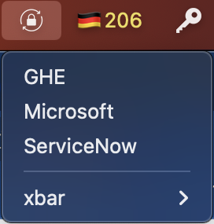

# Secure TOTP Authenticator plugin for xbar

A plugin to ease usage of TOTPs for the [xbar mac desktop utility](https://xbarapp.com/).

## Prerequisites

You need to have oath-toolkit installed. To do that you can use `brew install oath-toolkit`. If your environment is not
special the script should pick up the correct path to the `oathtool` binary. If not, you can set the path manually in
the script.

## Usage



- Use Homebrew to install xbar: `brew cask install xbar`
- Clone this repo to local and copy `secure-totp.sh` file to your xbar plugins folder
- Ensure the plugin is executable by running: `chmod +x <path to xbar plugins>/secure-totp.sh`
- Refresh the xbar

When you click on an entry, the token gets copied to the clipboard. After 30 seconds, the clipboard is automatically
emptied again. The token value is not part of the menu all the time and only created and copied to the clipboard when
needed.

### Manage OTP secrets

First decide where you want to put the OTP secrets. The default is `$HOME/.otp`. You can change this by editing the
`KEYFILE` variable in the vars file (`secure-totp.sh.vars.json`) in the xbar plugins folder. Only use full paths here!
`~` or `$HOME` won't work!

```json
{
    "KEYFILE": "/Users/xbar-user/.otp"
}

The secrets file should contain one line per OTP secret. The format is:

```
<key>:<base32 secret>
```

The key is used to identify the OTP secret and is shown in the menu. The base32 secret is the secret you get when you
set up the OTP secret in your authenticator app. you have to base32 encode it first:

```sh
$ echo foo | base32
MZXW6CQ=
```

To verify the value you can use the `oathtool` to generate the OTP token from the secret. For example:

```sh
$ oathtool --totp -b <base32 secret>
```
